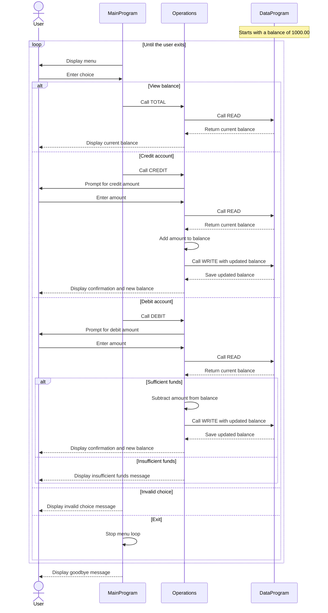

# School Accounting System Data Flow

```mermaid
sequenceDiagram
    actor User
    participant Main as MainProgram
    participant Operations
    participant Data as DataProgram

    Note over Data: Starts with a balance of 1000.00
    loop Until the user exits
        Main->>User: Display menu
        User->>Main: Enter choice
        alt View balance
            Main->>Operations: Call TOTAL
            Operations->>Data: Call READ
            Data-->>Operations: Return current balance
            Operations-->>User: Display current balance
        else Credit account
            Main->>Operations: Call CREDIT
            Operations->>User: Prompt for credit amount
            User->>Operations: Enter amount
            Operations->>Data: Call READ
            Data-->>Operations: Return current balance
            Operations->>Operations: Add amount to balance
            Operations->>Data: Call WRITE with updated balance
            Data-->>Operations: Save updated balance
            Operations-->>User: Display confirmation and new balance
        else Debit account
            Main->>Operations: Call DEBIT
            Operations->>User: Prompt for debit amount
            User->>Operations: Enter amount
            Operations->>Data: Call READ
            Data-->>Operations: Return current balance
            alt Sufficient funds
                Operations->>Operations: Subtract amount from balance
                Operations->>Data: Call WRITE with updated balance
                Data-->>Operations: Save updated balance
                Operations-->>User: Display confirmation and new balance
            else Insufficient funds
                Operations-->>User: Display insufficient funds message
            end
        else Invalid choice
            Main-->>User: Display invalid choice message
        else Exit
            Main->>Main: Stop menu loop
        end
    end
    Main-->>User: Display goodbye message
```
